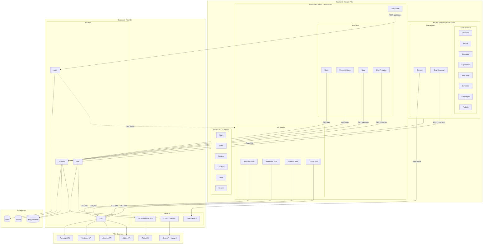
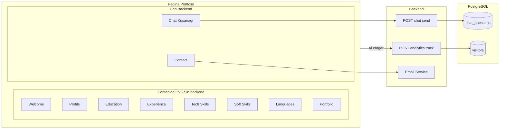
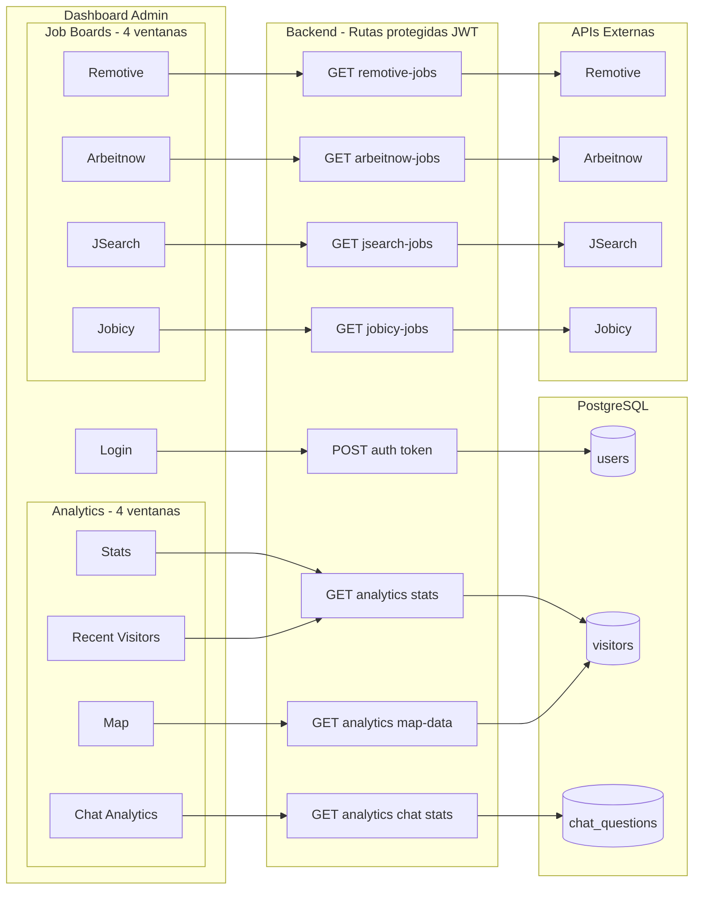
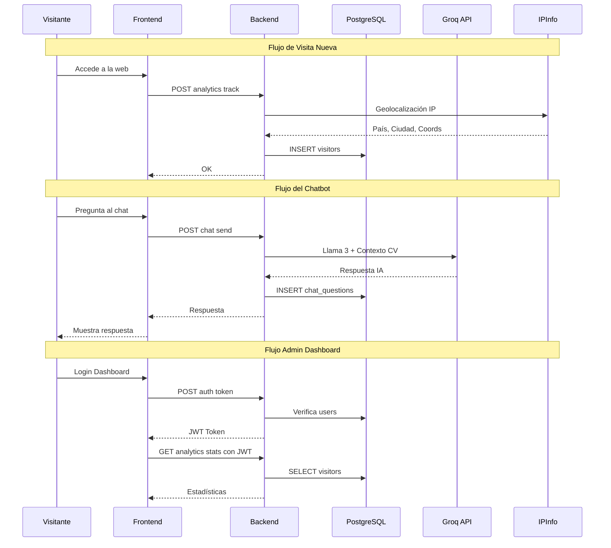

# Diagrama de Arquitectura - DigitalCV

## Arquitectura General

## Detalle de Ventanas

### Portfolio (10 ventanas)

### Dashboard (9 ventanas)

## Flujo de Datos

## Resumen de Ventanas

| Página | Ventana | Interacción Backend | Endpoint |
|--------|---------|---------------------|----------|
| Portfolio | Welcome | No | - |
| Portfolio | Profile | No | - |
| Portfolio | Education | No | - |
| Portfolio | Experience | No | - |
| Portfolio | Tech Skills | No | - |
| Portfolio | Soft Skills | No | - |
| Portfolio | Languages | No | - |
| Portfolio | Portfolio | No | - |
| Portfolio | Contact | Sí - Email | Email Service |
| Portfolio | Chat Kusanagi | Sí | POST chat send |
| Dashboard | Login | Sí | POST auth token |
| Dashboard | Stats | Sí | GET analytics stats |
| Dashboard | Recent Visitors | Sí | GET analytics stats |
| Dashboard | Map | Sí | GET analytics map-data |
| Dashboard | Chat Analytics | Sí | GET analytics chat stats |
| Dashboard | Remotive Jobs | Sí | GET remotive-jobs |
| Dashboard | Arbeitnow Jobs | Sí | GET arbeitnow-jobs |
| Dashboard | JSearch Jobs | Sí | GET jsearch-jobs |
| Dashboard | Jobicy Jobs | Sí | GET jobicy-jobs |

## Endpoints por Funcionalidad

| Componente Frontend | Endpoint Backend | Método | Descripción |
|---------------------|------------------|--------|-------------|
| Página principal | api v1 analytics track | POST | Registra visita |
| Chat Kusanagi | api v1 chat send | POST | Envía mensaje al chatbot |
| Remotive Jobs | api v1 remotive-jobs | GET | Ofertas Remotive |
| Arbeitnow Jobs | api v1 arbeitnow-jobs | GET | Ofertas Arbeitnow |
| JSearch Jobs | api v1 jsearch-jobs | GET | Ofertas JSearch |
| Jobicy Jobs | api v1 jobicy-jobs | GET | Ofertas Jobicy |
| Login Dashboard | api v1 auth token | POST | Autenticación JWT |
| Dashboard Stats | api v1 analytics stats | GET | Estadísticas admin |
| Dashboard Map | api v1 analytics map-data | GET | Datos mapa admin |
| Chat Analytics | api v1 analytics chat stats | GET | Stats chatbot admin |

## Tecnologías

| Capa | Tecnología |
|------|------------|
| Frontend | React 18, Vite, Three.js, JavaScript |
| Backend | FastAPI, Python 3.11, Uvicorn |
| Base de datos | PostgreSQL 15, SQLAlchemy, Alembic |
| Autenticación | JWT python-jose, bcrypt |
| IA Chatbot | Groq API Llama 3 |
| Geolocalización | IPInfo API |
| Despliegue | Docker, docker-compose |
